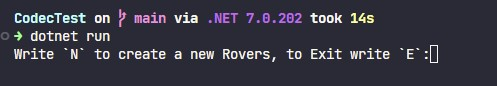
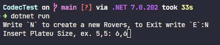
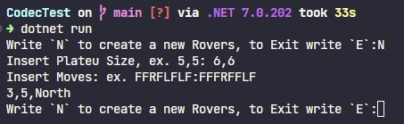

# CodecTest

## Table of Contents

- [Instructions](#instructions)

## Instructions

Rovers is a robot that is navigating the terrain of Mars. Mars plateau is a grid defined by the initial input of the app, such as 5x5, 3x4, etc.
When you initialize the program you will see a Menu:

If you select `N` it will create a new Rover and you would be able to control him:
To set the Plateu Size you can set it as 6,5

Then you set the Moves for the Rovers where `F` means Forward, `L` means turn Left, and `R` means turn Right.

To Exit select `E`.
